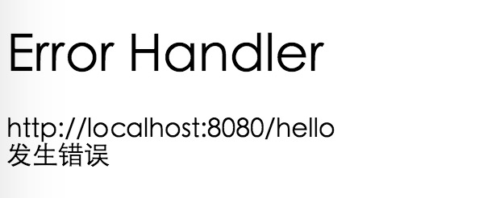

我们在做Web应用的时候，请求处理过程中发生错误是非常常见的情况。Spring Boot提供了一个默认的映射：``/error``，当处理中抛出异常之后，会转到该请求中处理，并且该请求有一个全局的错误页面用来展示异常内容。

选择一个之前实现过的Web应用（[lesson3-2](https://github.com/codeyoyo/spring-boot-learn/tree/master/springboot/lesson3-2)）为基础，启动该应用，访问一个不存在的URL，或是修改处理内容，直接抛出异常，如：

```
@RequestMapping("/hello")
public String hello() throws Exception {
    throw new Exception("发生错误");
}
```

此时，可以看到类似下面的报错页面，该页面就是Spring Boot提供的默认error映射页面。


## 统一异常处理

虽然，Spring Boot中实现了默认的error映射，但是在实际应用中，上面你的错误页面对用户来说并不够友好，我们通常需要去实现我们自己的异常提示。

下面我们以之前的Web应用例子为基础（[lesson3-2](https://github.com/codeyoyo/spring-boot-learn/tree/master/springboot/lesson3-2)），进行统一异常处理的改造。

* 创建全局异常处理类：通过使用``@ControllerAdvice``定义统一的异常处理类，而不是在每个Controller中逐个定义。``@ExceptionHandler``用来定义函数针对的异常类型，最后将Exception对象和请求URL映射到``error.html``中

```
@ControllerAdvice
class GlobalExceptionHandler {

    public static final String DEFAULT_ERROR_VIEW = "error";

    @ExceptionHandler(value = Exception.class)
    public ModelAndView defaultErrorHandler(HttpServletRequest req, Exception e) throws Exception {
        ModelAndView mav = new ModelAndView();
        mav.addObject("exception", e);
        mav.addObject("url", req.getRequestURL());
        mav.setViewName(DEFAULT_ERROR_VIEW);
        return mav;
    }

}
```

* 实现``error.html``页面展示：在``templates``目录下创建``error.html``，将请求的URL和Exception对象的message输出。

```
<!DOCTYPE html>
<html>
<head lang="en">
    <meta charset="UTF-8" />
    <title>统一异常处理</title>
</head>
<body>
    <h1>Error Handler</h1>
    <div th:text="${url}"></div>
    <div th:text="${exception.message}"></div>
</body>
</html>
```

启动该应用，访问：``http://localhost:8080/hello``，可以看到如下错误提示页面。



通过实现上述内容之后，我们只需要在``Controller``中抛出``Exception``，当然我们可能会有多种不同的``Exception``。然后在``@ControllerAdvice``类中，根据抛出的具体``Exception``类型匹配``@ExceptionHandler``中配置的异常类型来匹配错误映射和处理。

## 返回JSON格式

在上述例子中，通过``@ControllerAdvice``统一定义不同Exception映射到不同错误处理页面。而当我们要实现RESTful API时，返回的错误是JSON格式的数据，而不是HTML页面，这时候我们也能轻松支持。

本质上，只需在``@ExceptionHandler``之后加入``@ResponseBody``，就能让处理函数return的内容转换为JSON格式。

下面以一个具体示例来实现返回JSON格式的异常处理。

* 创建统一的JSON返回对象，code：消息类型，message：消息内容，url：请求的url，data：请求返回的数据

```
public class ErrorInfo<T> {

    public static final Integer OK = 0;
    public static final Integer ERROR = 100;

    private Integer code;
    private String message;
    private String url;
    private T data;

    // 省略getter和setter

}
```

* 创建一个自定义异常，用来实验捕获该异常，并返回json

```
public class MyException extends Exception {

    public MyException(String message) {
        super(message);
    }
    
}
```

* ``Controller``中增加json映射，抛出``MyException``异常

```
@Controller
public class HelloController {

    @RequestMapping("/json")
    public String json() throws MyException {
        throw new MyException("发生错误2");
    }

}
```

为``MyException``异常创建对应的处理

```
@ControllerAdvice
public class GlobalExceptionHandler {

    @ExceptionHandler(value = MyException.class)
    @ResponseBody
    public ErrorInfo<String> jsonErrorHandler(HttpServletRequest req, MyException e) throws Exception {
        ErrorInfo<String> r = new ErrorInfo<>();
        r.setMessage(e.getMessage());
        r.setCode(ErrorInfo.ERROR);
        r.setData("Some Data");
        r.setUrl(req.getRequestURL().toString());
        return r;
    }

}
```

* 启动应用，访问：[http://localhost:8080/json](http://localhost:8080/json)，可以得到如下返回内容：

```
{
    code: 100，
    data: "Some Data"，
    message: "发生错误2"，
    url: "http://localhost:8080/json"
}
```

至此，已完成在Spring Boot中创建统一的异常处理，实际实现还是依靠Spring MVC的注解，更多更深入的使用可参考Spring MVC的文档。

[完整示例：lesson3-4](https://github.com/codeyoyo/spring-boot-learn/tree/master/springboot/lesson3-4)