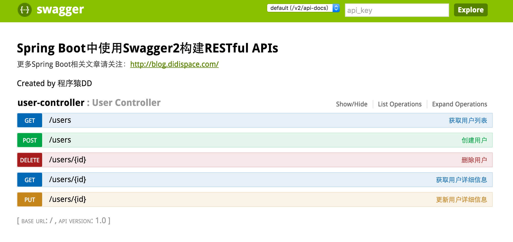
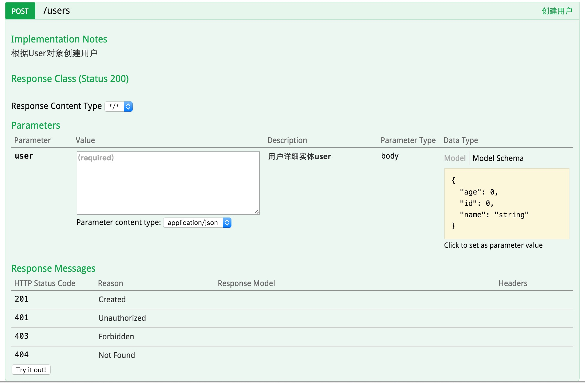

由于Spring Boot能够快速开发、便捷部署等特性，相信有很大一部分Spring Boot的用户会用来构建RESTful API。而我们构建RESTful API的目的通常都是由于多终端的原因，这些终端会共用很多底层业务逻辑，因此我们会抽象出这样一层来同时服务于多个移动端或者Web前端。

这样一来，我们的RESTful API就有可能要面对多个开发人员或多个开发团队：IOS开发、Android开发或是Web开发等。为了减少与其他团队平时开发期间的频繁沟通成本，传统做法我们会创建一份RESTful API文档来记录所有接口细节，然而这样的做法有以下几个问题：

* 由于接口众多，并且细节复杂（需要考虑不同的HTTP请求类型、HTTP头部信息、HTTP请求内容等），高质量地创建这份文档本身就是件非常吃力的事，下游的抱怨声不绝于耳。
* 随着时间推移，不断修改接口实现的时候都必须同步修改接口文档，而文档与代码又处于两个不同的媒介，除非有严格的管理机制，不然很容易导致不一致现象。

为了解决上面这样的问题，本文将介绍RESTful API的重磅好伙伴Swagger2，它可以轻松的整合到Spring Boot中，并与Spring MVC程序配合组织出强大RESTful API文档。它既可以减少我们创建文档的工作量，同时说明内容又整合入实现代码中，让维护文档和修改代码整合为一体，可以让我们在修改代码逻辑的同时方便的修改文档说明。另外Swagger2也提供了强大的页面测试功能来调试每个RESTful API。具体效果如下图所示：



下面来具体介绍，如果在Spring Boot中使用Swagger2。首先，我们需要一个Spring Boot实现的RESTful API工程，若您没有做过这类内容，建议先阅读
[Spring Boot构建一个较为复杂的RESTful APIs和单元测试](/Web/RESTfulAPI)。

下面的内容我们会以[教程样例中](https://gitee.com/didispace/SpringBoot-Learning)的Chapter3-1-1进行下面的实验（Chpater3-1-5是我们的结果工程，亦可参考）。

### 添加Swagger2依赖

在``pom.xml``中加入Swagger2的依赖

```
<dependency>
    <groupId>io.springfox</groupId>
    <artifactId>springfox-swagger2</artifactId>
    <version>2.2.2</version>
</dependency>
<dependency>
    <groupId>io.springfox</groupId>
    <artifactId>springfox-swagger-ui</artifactId>
    <version>2.2.2</version>
</dependency>
```

### 创建Swagger2配置类

在``Application.java``同级创建Swagger2的配置类``Swagger2``。

```
@Configuration
@EnableSwagger2
public class Swagger2 {

    @Bean
    public Docket createRestApi() {
        return new Docket(DocumentationType.SWAGGER_2)
                .apiInfo(apiInfo())
                .select()
                .apis(RequestHandlerSelectors.basePackage("com.didispace.web"))
                .paths(PathSelectors.any())
                .build();
    }

    private ApiInfo apiInfo() {
        return new ApiInfoBuilder()
                .title("Spring Boot中使用Swagger2构建RESTful APIs")
                .description("更多Spring Boot相关文章请关注：http://blog.didispace.com/")
                .termsOfServiceUrl("http://blog.didispace.com/")
                .contact("程序猿DD")
                .version("1.0")
                .build();
    }

}
```

如上代码所示，通过``@Configuration``注解，让Spring来加载该类配置。再通过``@EnableSwagger2``注解来启用Swagger2。

再通过``createRestApi``函数创建``Docket``的Bean之后，``apiInfo()``用来创建该Api的基本信息（这些基本信息会展现在文档页面中）。``select()``函数返回一个``ApiSelectorBuilder``实例用来控制哪些接口暴露给Swagger来展现，本例采用指定扫描的包路径来定义，Swagger会扫描该包下所有Controller定义的API，并产生文档内容（除了被``@ApiIgnore``指定的请求）。

### 添加文档内容

在完成了上述配置后，其实已经可以生产文档内容，但是这样的文档主要针对请求本身，而描述主要来源于函数等命名产生，对用户并不友好，我们通常需要自己增加一些说明来丰富文档内容。如下所示，我们通过``@ApiOperation``注解来给API增加说明、通过``@ApiImplicitParams``、``@ApiImplicitParam``注解来给参数增加说明。

```
@RestController
@RequestMapping(value="/users")     // 通过这里配置使下面的映射都在/users下，可去除
public class UserController {

    static Map<Long, User> users = Collections.synchronizedMap(new HashMap<Long, User>());

    @ApiOperation(value="获取用户列表", notes="")
    @RequestMapping(value={""}, method=RequestMethod.GET)
    public List<User> getUserList() {
        List<User> r = new ArrayList<User>(users.values());
        return r;
    }

    @ApiOperation(value="创建用户", notes="根据User对象创建用户")
    @ApiImplicitParam(name = "user", value = "用户详细实体user", required = true, dataType = "User")
    @RequestMapping(value="", method=RequestMethod.POST)
    public String postUser(@RequestBody User user) {
        users.put(user.getId(), user);
        return "success";
    }

    @ApiOperation(value="获取用户详细信息", notes="根据url的id来获取用户详细信息")
    @ApiImplicitParam(name = "id", value = "用户ID", required = true, dataType = "Long")
    @RequestMapping(value="/{id}", method=RequestMethod.GET)
    public User getUser(@PathVariable Long id) {
        return users.get(id);
    }

    @ApiOperation(value="更新用户详细信息", notes="根据url的id来指定更新对象，并根据传过来的user信息来更新用户详细信息")
    @ApiImplicitParams({
            @ApiImplicitParam(name = "id", value = "用户ID", required = true, dataType = "Long"),
            @ApiImplicitParam(name = "user", value = "用户详细实体user", required = true, dataType = "User")
    })
    @RequestMapping(value="/{id}", method=RequestMethod.PUT)
    public String putUser(@PathVariable Long id, @RequestBody User user) {
        User u = users.get(id);
        u.setName(user.getName());
        u.setAge(user.getAge());
        users.put(id, u);
        return "success";
    }

    @ApiOperation(value="删除用户", notes="根据url的id来指定删除对象")
    @ApiImplicitParam(name = "id", value = "用户ID", required = true, dataType = "Long")
    @RequestMapping(value="/{id}", method=RequestMethod.DELETE)
    public String deleteUser(@PathVariable Long id) {
        users.remove(id);
        return "success";
    }

}
```

完成上述代码添加上，启动Spring Boot程序，访问：[http://localhost:8080/swagger-ui.html](http://localhost:8080/swagger-ui.html)
。就能看到前文所展示的RESTful API的页面。我们可以再点开具体的API请求，以POST类型的/users请求为例，可找到上述代码中我们配置的Notes信息以及参数user的描述信息，如下图所示。



### API文档访问与调试

在上图请求的页面中，我们看到user的Value是个输入框？是的，Swagger除了查看接口功能外，还提供了调试测试功能，我们可以点击上图中右侧的Model Schema（黄色区域：它指明了User的数据结构），此时Value中就有了user对象的模板，我们只需要稍适修改，点击下方``“Try it out！”``按钮，即可完成了一次请求调用！

此时，你也可以通过几个GET请求来验证之前的POST请求是否正确。

相比为这些接口编写文档的工作，我们增加的配置内容是非常少而且精简的，对于原有代码的侵入也在忍受范围之内。因此，在构建RESTful API的同时，加入swagger来对API文档进行管理，是个不错的选择。

完整结果示例可查看[Chapter3-1-5](Chapter3-1-5)。

### 参考信息

* [Swagger官方网站](http://swagger.io/)